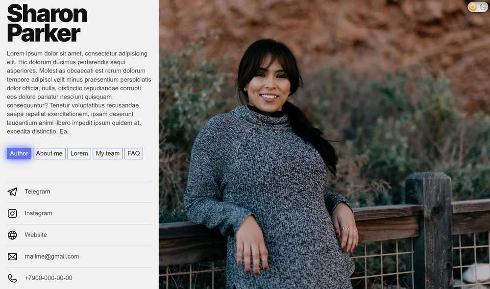
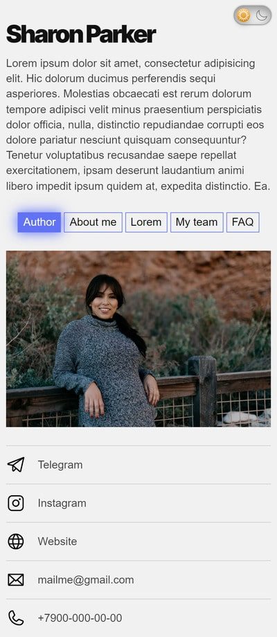
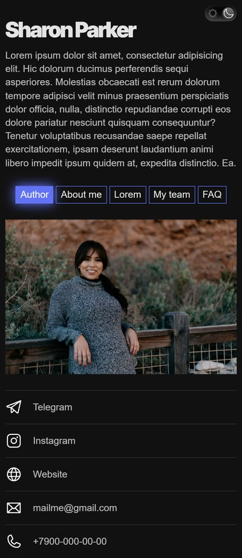

Пример портфолио для одного специалиста или для команды.

[Превью](https://eugiss.github.io/Design-team-portfolio/)

## Функционал
- плавная закрузка страницы
- mobile-first
- корректная семантическая верстка
- 'резиновый' адаптив
- hover-эффекты на кликабельных элементах
- переключение темы (темная/светлая)
  - при первоначальной загрузке страницы - на странице устанавливается тема, использующаяся на устройстве
  - при смене темы на устройстве - на странице она также меняется
  - при переключении ползунка
  - заданная тема не сбрасывается при обновлении страницы
- переключение табов
- при большом количестве контента внутри табов, основной контент (меню, основня информация и контакты) - виден на экране, скролл производится внутри табов
- переключение активного фото участника команды
- при переключении фото команды - показывается соответствующая информация об участнике
- аккордеон с возможностью открыть только один спойлер
- стилизация скроллбара
 
## Скриншоты

  &nbsp;&nbsp;

  &nbsp;&nbsp;

## При разработке использовалось:
- gulp
- scss
- css переменные
- flexbox
- grid
- jQuery
